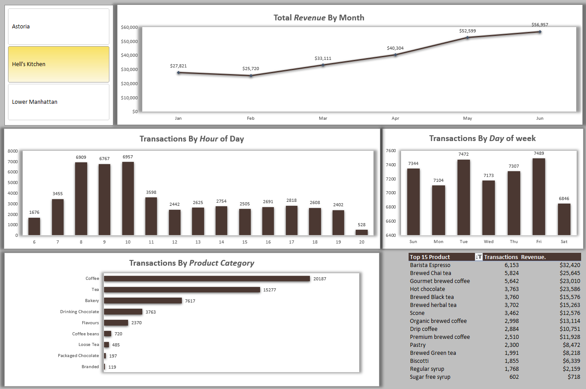

**Coffee Shop Sales Analysis**

This project involves a comprehensive sales analysis for a NYC coffee shop. I processed over 149,000 records to build a dynamic dashboard that helps in data-driven decision-making.

 **Key Insights Found**
* **Peak Hours:** Identified 7:00 AM - 10:00 AM as the busiest period, suggesting a need for more staff during these hours.
* **Peak Days:** Mondays show the highest transaction volume.
* **Top Product:** Barista Espresso is the top-selling product by both transactions and revenue.

***Tools Used***
* Excel (Data Cleaning, Pivot Tables, Pivot Charts).
* Data Visualization & Dashboard Design.
